# 🎨 Kontext Chat - Edit Any Image By Chatting With AI

Interactive chat application for creating and editing images using FAL AI's Flux Kontext Dev with LoRA support and real-time streaming. Chat with AI to create new images, edit existing ones, apply artistic styles, or get detailed image descriptions.

## 🛠️ Tech Stack

- **Frontend:** React, Next.js 15 (App Router), TypeScript
- **Styling:** Tailwind CSS, Shadcn UI
- **AI & Chat:** Vercel AI SDK, OpenAI GPT
- **AI Image Generation:** FAL AI Flux Kontext LoRA
- **State Management:** React Hooks, Local Storage
- **Rate Limiting:** Upstash Redis via Vercel KV
- **Bot Protection:** BotID
- **Validation:** Zod
- **Package Manager:** pnpm

## ✨ Features

- **🖼️ AI Image Generation & Editing**
  - Edit existing images with Flux Kontext
  - Create new images from scratch
  - Apply 23+ predefined LoRA styles to images
  - Real-time image streaming with intermediate previews

- **💬 AI Chat**
  - Chatbot powered by Vercel AI SDK and OpenAI GPT-4.1 mini
  - Upload your own images and start editing
  - Ask questions about the image using multi-modal LLMs
  - Use previous images as input
  - Download generated images at max quality

- **🔑 API Key Management**
  - Bring Your Own Key (BYOK) system for unlimited usage
  - Rate limiting for free users (4 requests per day)
  - Local storage for API key management
  - Graceful error handling and user feedback

- **🎯 Modern UI/UX**
  - Fully responsive design built with shadcn/ui
  - Real-time progress indicators and streaming updates
  - Loading states and smooth animations
  - Example images and prompts to get started quickly
  - Style selection dialog with visual previews

## 📋 Prerequisites

- Node.js 18+
- pnpm
- FAL AI API key
- OpenAI API key
- Upstash Redis instance (optional, for rate limiting)

## 🏗️ Architecture

```mermaid
graph TB
    %% Frontend Layer
    subgraph Frontend["🎨 Frontend (Next.js 15)"]
        Page["📱 page.tsx<br/>Main Chat Interface"]
        ChatLayout["💬 ChatLayout<br/>Message Display"]
        ChatInput["⌨️ ChatInput<br/>File Upload & Style Selection"]
        StyleDialog["🎭 StyleSelectionDialog<br/>Style Picker"]

        Page --> ChatLayout
        Page --> ChatInput
        Page --> StyleDialog
    end

    %% State Management
    subgraph StateHooks["🔄 State Management (React Hooks)"]
        ChatHandlers["useChatHandlers<br/>Message Submission"]
        FileUpload["useFileUpload<br/>Drag & Drop"]
        StyleSelection["useStyleSelection<br/>LoRA Selection"]
        ApiKeyStorage["api-key-storage<br/>Local Storage"]

        ChatInput --> ChatHandlers
        ChatInput --> FileUpload
        ChatInput --> StyleSelection
        Page --> ApiKeyStorage
    end

    %% Chat API Layer
    subgraph ChatAPI["🤖 Chat API (Vercel AI SDK)"]
        ChatRoute["📡 /api/chat/route.ts<br/>Streaming Endpoint"]
        StreamText["🌊 streamText<br/>AI Model Processing"]
        Tools["🛠️ Tools"]

        ChatRoute --> StreamText
        StreamText --> Tools
    end

    %% AI Tools
    subgraph AITools["⚡ AI Tools"]
        CreateImage["🎨 createImage<br/>Generate New Images"]
        EditImage["✏️ editImage<br/>Style Transfer"]
        DescribeImage["👁️ describeImage<br/>Image Analysis"]

        Tools --> CreateImage
        Tools --> EditImage
        Tools --> DescribeImage
    end

    %% External Services
    subgraph External["🌐 External Services"]
        FAL["🎭 FAL AI<br/>Flux Kontext LoRA"]
        OpenAI["🧠 OpenAI GPT<br/>Chat Model"]
        Redis["⚡ Upstash Redis<br/>Rate Limiting"]
        BotID["🛡️ BotID<br/>Bot Protection"]

        CreateImage --> FAL
        EditImage --> FAL
        DescribeImage --> OpenAI
        StreamText --> OpenAI
        ChatRoute --> Redis
        ChatRoute --> BotID
    end

    %% Style System
    subgraph Styles["🎨 Style System"]
        Models["📋 models.ts<br/>23+ Predefined Styles"]
        CustomLora["🔧 Custom LoRA URLs<br/>Advanced Users"]

        StyleSelection --> Models
        StyleSelection --> CustomLora
        Models --> FAL
        CustomLora --> FAL
    end

    %% Security & Rate Limiting
    subgraph Security["🔒 Security Layer"]
        RateLimit["⏱️ Rate Limiting<br/>4 requests/day"]
        BYOK["🔑 Bring Your Own Key<br/>Unlimited Usage"]
        Validation["✅ Input Validation<br/>Zod Schemas"]

        ChatRoute --> RateLimit
        ChatRoute --> BYOK
        ChatRoute --> Validation
    end

    %% Data Flow
    Frontend -.->|User Input| ChatAPI
    ChatAPI -.->|Streaming Response| Frontend
    StateHooks -.->|State Updates| Frontend

    %% Message Flow
    classDef frontend fill:#e1f5fe
    classDef api fill:#f3e5f5
    classDef external fill:#e8f5e8
    classDef security fill:#fff3e0
    classDef tools fill:#fce4ec

    class Page,ChatLayout,ChatInput,StyleDialog frontend
    class ChatRoute,StreamText,Tools api
    class FAL,OpenAI,Redis,BotID external
    class RateLimit,BYOK,Validation security
    class CreateImage,EditImage,DescribeImage tools
```



## 🚀 Installation

1. **Clone the repository**

   ```bash
   git clone https://github.com/yourusername/fal-flux-kontext-demo.git
   cd fal-flux-kontext-demo
   ```

2. **Install dependencies**

   ```bash
   pnpm install
   ```

3. **Set up environment variables**

   ```bash
   cp .env.example .env.local
   ```

4. **Run the development server**

   ```bash
   pnpm dev
   ```

   Open [http://localhost:3000](http://localhost:3000) in your browser.

**Test Mode**: Set `TEST_MODE=true` in your environment to use mock images and avoid API costs during development.

## 📄 License

This project is licensed under the MIT License.
